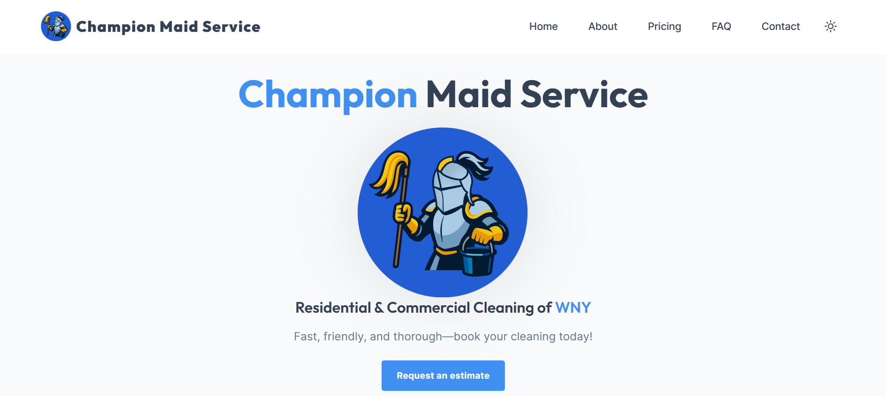

# Champion Maid Service Website

This is the official website for **Champion Maid Service**, built with [Astro](https://astro.build/) and [TailwindCSS](https://tailwindcss.com/).  
The site is deployed at: [https://gaberashko.github.io/champion-maid-service](https://gaberashko.github.io/champion-maid-service)

---

## About

The website provides information about Champion Maid Service, including services, contact information, and an online contact form.
It is responsive, SEO-friendly, and optimized for performance.


---

## Features

-   ✅ Built with [Astro](https://astro.build/) + [TailwindCSS](https://tailwindcss.com/) + [TypeScript](https://www.typescriptlang.org/) for quick development and performance.
-   ✅ Responsive design on mobile & desktop.
-   ✅ SEO-friendly with sitemap integration.
-   ✅ Smooth page transitions & animations.
-   ✅ Contact form powered by [FormSubmit](https://formsubmit.co/)
-   ✅ Deployed with GitHub pages.

---

## Getting Started

If you'd like to run this product locally:

```bash
# Install dependencies
npm install

# Run development server
npm run dev

# Build for production
npm run build

# Preview build
npm run preview
```

The production build outputs to the `/dist` folder.

---

### Folder structure

Inside the repository are the following folders and files:

```plaintext
/
├── public/
│   └── favicon.svg
├── src/
│   ├── assets/
│   ├── components/
│   │   ├── blocks/
│   │   │   └── ...
│   │   └── ui/
│   │       └── ...
│   ├── config/
│   │   └── ...
│   ├── content/
│   │   └── blog/
│   │       └── ...
│   ├── data/
│   │   └── ...
│   ├── icons/
│   │   └── ...
│   ├── layouts/
│   │   └── ...
│   ├── page-sections/
│   │   └── home/
│   │       └── ...
│   └── pages/
│       └── ...
└── package.json
```

| Directory/File           | Description                                                                                                                             |
| ------------------------ | --------------------------------------------------------------------------------------------------------------------------------------- |
| `public/`                | Contains static assets like images and the favicon. These files are served directly at the root URL.                                    |
| `src/assets/`            | Contains all images and assets used in the project.                                                                                     |
| `src/components/`        | Contains reusable web components for the site. This directory is divided into `ui` for UI components and `blocks` for section blocks.   |
| `src/components/blocks/` | Contains section blocks used throughout the site.                                                                                       |
| `src/components/ui/`     | Contains individual UI components.                                                                                                      |
| `src/config/`            | Contains configuration files for the project in typescript format.                                                                      |
| `src/content/`           | Holds collection data, such as blog posts.                                                                                              |
| `src/content/blog/`      | Contains individual blog posts in markdown (remnant of Oxygenna template).                                                              |
| `src/data/`              | Contains JSON and md files with content data (features, etc.).                                                                          |
| `src/icons/`             | Contains all icons used in the project, sourced from [Heroicons](https://heroicons.com/) and tweaked in [Figma](https://www.figma.com). |
| `src/layouts/`           | Contains layout components that define the overall structure of the pages.                                                              |
| `src/pages/`             | Contains `.astro` files for each page. Each file here is exposed as a route based on its file name.                                     |
| `package.json`           | Lists dependencies and scripts for the project, including metadata and various package requirements.                                    |
| `tailwind.config.js`     | Contains elements that compose the site's theme, such as the theme's color palette, font family, etc.                                   |

| Configuration File               | Description                                                                                     |
| -------------------------------- | ----------------------------------------------------------------------------------------------- |
| `src/config/config.ts`           | Includes the basic configuration settings including SEO, mode, and scroll animations.           |
| `src/config/navigationBar.ts`    | Includes menu options for the navigation bar.                                                   |
| `src/config/footerNavigation.ts` | Includes menu options for the footer navigation.                                                |
| `src/config/analytics.ts`        | Includes the required codes for Google Analytics, Google Tag Manager and Google Search Console. |
| `src/config/socialLinks.ts`      | Contains the social link data for the website.                                                  |

### Dark/Light Mode

By default, the site uses an automatic mode switcher, allowing it users to switch between light and dark modes based on the user's system settings or by using the mode switcher in the navigation bar. This is achieved by setting the `mode-auto` class in the `Layout.astro` file.

If you need to enforce a specific theme, you can set the class above as **`mode-light`** or **`mode-dark`**. When **`mode-light`** is applied, the site will consistently display in light mode, and the switcher will not be functional. Similarly, **`mode-dark`** will force the site to dark mode, with the switcher rendered non-functional. These settings allow you to maintain a fixed appearance across the site regardless of user preferences or system settings.

## License

This project uses an MIT-licensed template:

-   Template: _Foxi - Astro Theme_
-   Copyright © 2024 Oxygenna

Custom modifications such as branding, logos, images, text, and web components are:
**Copyright © 2025 Champion Maid Service. All rights reserved.**

> See [COPYRIGHT.md](/COPYRIGHT.md) for more details.
